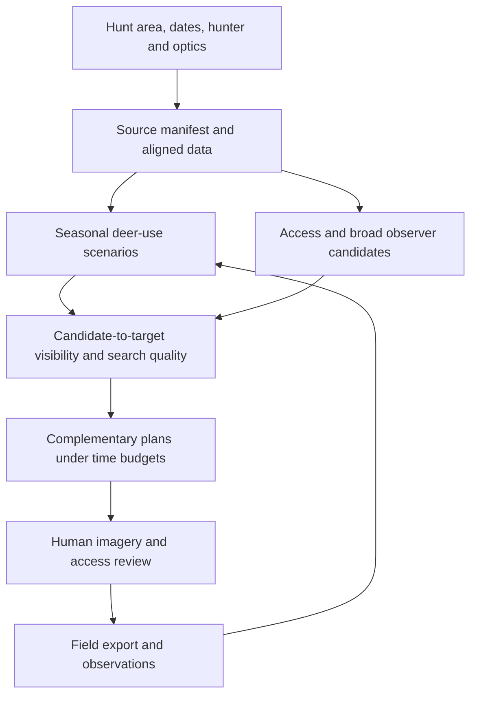

# Automating mule deer glassing: research and design decision report

**Prepared for Tanner Petersen · 25 September 2026**  
**Decision scope:** western mountainous public-land mule deer hunting; methodology selection and experimental system design.  
**Status:** researched design, not a field-validated product. No HuntMaps code audit, unit-wide computation, or field experiment was performed for this study.

## 1. Executive conclusion

**Build a small experiment around an interpretable, target-first search planner—not a unit-wide “best viewshed” engine.** Use existing GIS and field mapping software. Automate data preparation, candidate screening, visibility, useful coverage, and selection of complementary observation opportunities. Retain human review of deer-use assumptions, imagery, access, and the final field position.

The strongest practical architecture is a **hybrid of seasonal target mapping, broad observer generation, terrain visibility, vegetation-aware detection scoring, and time-budgeted multi-point planning**. Target-first describes the objective, not permission to discard everything outside a speculative habitat mask. Include observer-first and spatially distributed candidates to protect against a wrong deer model.

The immediate recommendation is a bounded experiment in a **50–100 km² portion of Colorado GMU 54**, with a smaller Utah validation area if practical. Compare expert planning, raw viewsheds, habitat weighting, glassability weighting, and multi-point selection. Use identical access and time budgets. Add one emerging automated hunting tool if its output is obtainable and inspectable.

**Do not commit to a major software build until that experiment demonstrates either better independently measured search value or substantial planning-time savings without worse field performance.** There is good evidence that the component methods work in GIS and related observation problems. There is not yet evidence from this review that their combination increases western mule deer sightings per hour by a particular percentage.

### Ranked choices

| Rank | Choice | Recommendation |
|---|---|---|
| 1 | Small specialized Python analysis component + QGIS review + existing field app | Best development candidate for repeated use across large areas; proceed only through experiment gates |
| 2 | Human-assisted onX/CalTopo/GOHUNT plus agency habitat information | Best immediately usable workflow; remains the fallback if custom analysis fails to add value |
| 3 | ArcGIS Pro implementation of the same methodology | Strong substitute if an appropriate personally authorized license and existing proficiency make it cheaper to implement |
| 4 | Exhaustive high-resolution visibility/vegetation optimization | Useful as a small-area benchmark or selective refinement; poor default architecture |
| 5 | Learned end-to-end deer/glassing recommendation model | Defer: representative, effort-aware hunting-season labels are the missing asset |

**HuntMaps decision:** its existing architecture is neither a reason to continue nor a reason to discard it. Reuse only independently useful ingestion, reprojection, access, and export functions that pass an audit. Put the experimental scoring and selection logic behind a separate interface. If those reusable functions are tightly coupled or unreliable, a clean specialized component is preferable to rebuilding the whole mapping application.

**Confidence:** high that bare-earth visible acreage is an insufficient objective; moderate that the proposed hybrid offers the best practical development path; low on the size of its hunting benefit until tested. The last two assessments are design judgments, not published comparative findings.

## 2. What problem we should actually solve

The decision is: **Which observation actions should this hunter take, in this season and under plausible conditions, to find useful deer opportunities within a finite time and access budget?** An action includes a position, viewing sectors, time window, and dwell time. A waypoint alone leaves most of the decision unspecified.

### Six separate concepts

| Concept | Question | Suitable representation | Common error |
|---|---|---|---|
| Terrain visibility | Does terrain interrupt the sightline? | DEM-based line of sight, with observer and target height | Treating visible ground as visible deer |
| Terrain glassability | Can a person effectively inspect this terrain with these optics? | Conditional detection quality by distance, cover, orientation, light and search effort | Treating every visible hectare equally |
| Habitat value | Can the landscape provide useful forage, security, thermal cover or travel habitat? | Ecological attributes and broad relative suitability | Equating good habitat with current occupancy |
| Seasonal deer use | Are the desired deer likely to use the patch during the relevant window? | Seasonal/scenario-specific relative use, later calibrated occupancy or density | Calling an expert score a probability |
| Hunter accessibility | Can the hunter legally and physically reach, occupy and leave the point? | Connected access graph and directional travel costs | Calling all public land accessible |
| Strategic hunting value | Does observing here produce actionable information or an attainable hunting opportunity? | Detection value, follow-up feasibility, complementary coverage and route budget | Rewarding deer visible across inaccessible private land or impassable terrain |

A large visible basin can be inferior to a smaller bench if the bench holds more relevant deer, is inspectable at useful distances, and can be reached without losing the best light. Conversely, a conspicuous roadside point can be excellent. Roadless preferences belong in configurable objectives, not universal exclusion rules.

### Factor placement

| Factor group | How it should enter the system |
|---|---|
| Seasonal range, migration, elevation, snow, rut stage | Deer-use scenarios; avoid assuming a fixed calendar elevation band |
| Slope, aspect, bedding/feeding cover, disturbance age, forage and water | Habitat hypotheses with local context; separate feeding, bedding and transit targets |
| Timber density, shrubs, openings, edges | Both habitat and observation model, with separate causal roles |
| Distance, optics, observer-facing slope, terrain texture | Detection/search difficulty; detect versus classify versus judge antlers separately |
| Sun, shade, glare, haze, wind and precipitation | Time-dependent observation quality and feasibility; local wind uncertainty retained |
| Roads, trailheads, camps, other seasons and observed people | Access network plus uncertain pressure scenarios |
| Ownership, permissions, closures and hunt boundary | Hard feasibility constraints, including the approach and target follow-up |
| Hike distance, gain, darkness, roughness, pack-out | Directional travel and time budgets; safety exclusions and manual review |
| Overlap between points | Marginal additional coverage, not independent point scores added together |
| Ability to stalk or investigate | Separate actionable-opportunity output and optional constraint |

For a trophy-oriented hunter, **finding any deer, finding bucks, identifying a mature buck and judging antlers are distinct objectives**. Public datasets usually support the first much better than the last. Do not manufacture a “180-inch buck likelihood” raster. Use unit/herd information as broad context and retain uncertainty at patch scale.

The most useful initial deliverable is a small set of **robust observation areas**, each with an approximate setup location, sectors to inspect, distance bands, recommended time window, approach, alternatives and reasons it might fail. Final positions may move tens of meters on the ground.

## 3. Most important insights from research

### 3.1 Observation placement is an established optimization problem

Wildfire research already combines spatial risk, terrain visibility, location-allocation and budget-constrained coverage. That is a stronger analogy than simply copying tower locations or maximizing a hilltop's view. Detection range and what deserves observation both matter. The transfer to hunting is methodological; reported fire-monitoring improvements cannot be interpreted as deer-finding gains. [S12]

Visual-resource analysis goes beyond binary visibility: GRASS's `r.viewshed.exposure` supports weighting and distance/perspective functions. This establishes usable precedents for accounting for apparent terrain orientation and viewing distance. Its objective is visual exposure, not deer detection, so its coefficients are not hunting calibration. [S11]

Search-and-rescue and informative path planning add the missing element: spend travel and observation time where it produces the most expected information or detection. They also motivate updating a plan after observations. A deer population is mobile and noncooperative, so SAR assumptions must not be copied unchanged. [S15, S16]

Camera-placement research contributes a useful separation between generating candidate configurations, calculating detection/visibility matrices, and optimizing the selected subset. A mountainous observation-post study similarly incorporated likely movement routes rather than maximizing detected area alone. The transferable ideas are target weighting, directional coverage and scenario evaluation—not adversarial assumptions about deer or the papers' application-specific performance gains. [S58, S59]

### 3.2 Deer use can conflict with deer visibility

A Wyoming rifle-season study found that males selected security habitat farther from motorized routes, while females continued using higher-quality forage. Thus an accessible opening rich in doe observations is not necessarily the best target for hunting bucks. [S17]

A Montana winter study found selection for canopy that intercepted snow, with responses varying among study areas. A model that uniformly penalizes forest in its deer-use layer would therefore be ecologically wrong in some conditions—even though dense forest can still be difficult to glass. [S18]

### 3.3 Vegetation is not a small cosmetic correction

A wildlife point-count study in 34 Florida wetlands reported that lidar reduced estimated visible area by roughly half relative to its terrain-only comparison. This supports testing vegetation-aware visibility, but the magnitude cannot be transferred to western mountains. The publisher abstract was retrievable through search; full-text access was unsuccessful, so this report does not rely on uninspected implementation details. [S13]

The largest practical error may be a few trees beside the observer, not the DEM resolution across a distant basin. Spend high-resolution analysis first on finalists, foreground obstructions and borderline sightlines.

A western U.S. terrestrial-lidar study spanning forest, shrub-steppe, prairie and desert found that vantage height and vegetation structure affected visibility in nonlinear, ecosystem-dependent ways. Its fine-scale plots support the importance of local geometry; they do not provide a kilometer-scale optical detection calibration. [S57]

### 3.4 Better data already exists than a simple 30 m land-cover map

RAP now offers annual 10 m vegetation-cover estimates from 2018 onward, including tree, shrub, sagebrush and pinyon-juniper components. This is a credible starting feature source for open western rangelands. It is not a canopy ray-tracing model, and its “gap” variables are not mapped windows through which a hunter can see. [S23]

LANDFIRE provides vegetation type, cover and height, but explicitly discourages interpretation of individual or very small groups of 30 m pixels. Resampling these layers to 1 m does not make them tree maps. [S22]

### 3.5 A more precise surface does not fix a poorly specified objective

USGS distributes bare-earth elevation and lidar point clouds; an elevation file derived from lidar is not automatically a surface model containing trees. The expanding seamless 1 m product also has source/provenance qualifications. Coverage, age and effective accuracy must be examined locally. [S20, S21]

If two points reverse rank only when an uncertain habitat coefficient changes slightly, computing both at 1 m precision does not solve the decision. Show both alternatives and spend effort on the uncertainty that changes the choice.

### 3.6 The market has relevant new entrants, but validation remains the issue

The review found public descriptions of Hunt Vantage, HuntDialed, OpenHunt and ScopX, in addition to the established tools. Some already combine terrain, vegetation proxies, wind, or planning. Their documentation is evidence of claimed functionality, not evidence of field superiority. Include a usable entrant in the experiment before assuming custom software is necessary. [S44–S47]

### 3.7 Human search capacity must be budgeted

A 360° panorama is not searched instantly. A huge viewshed can dilute attention and consume the entire morning. The optimizer should identify **which sectors to inspect and for how long**, not just accumulate visible acreage. Detection curves and scan rates are presently calibration needs, not known universal constants.

## 4. Existing technology landscape

Capabilities below were checked against current public documentation or provider pages. This was a documentation review, not an authenticated product trial or installation test. “Not verified” does not mean a feature cannot exist.

| Tool | Verified relevant role | Boundary for this task |
|---|---|---|
| onX Hunt / TerrainX | Desktop Elite terrain filtering and interactive viewshed; field maps and markups [S01] | No documented, externally controllable habitat-weighted multi-point optimization found. Do not assume its lidar display means canopy-aware viewshed |
| GOHUNT Maps | Terrain analysis, 3D/glassing mode, historical imagery, land layers and offline maps; advanced terrain/historical tools web-only [S02] | Strong human planning interface; no verified automated conditional detection/route optimizer |
| BaseMap | 3D/offline mapping, land information, imagery, fires/timbercuts/roads/trails and rangefinder mapping [S03] | Useful field interface; automatic deer-use-weighted point selection not verified |
| Gaia GPS | Broad layer catalog, slope, public/private land, USFS/MVUM and offline planning [S04] | Navigation/data review; not a verified glassing optimizer |
| CalTopo | Viewshed, sun exposure and terrain tools [S05] | Particularly useful low-build baseline and independent manual check |
| ArcGIS Pro | Integrated raster/vector workflow and scriptable analysis [S09] | Capable host; requires correct license/extensions and user setup |
| ArcGIS Viewshed / Geodesic Viewshed | Terrain visibility; Geodesic Viewshed, historically Viewshed 2, supports GPU/CPU processing and vertical-error options [S09] | Models surface visibility; its uncertainty is not deer detection probability |
| QGIS | Review, digitizing, visualization and processing; maintained Visibility Analysis plugin listing [S06] | Best proposed review interface; pin and test compatible provider/plugin versions |
| GRASS GIS | `r.viewshed`, cumulative/exposure analysis, `r.walk`, path extraction [S08, S10, S11] | Strong reproducible reference engine; region settings and memory need explicit control |
| GDAL | Scriptable raster preparation and viewsheds; cumulative mode available [S07] | Good batch candidate, subject to engine agreement testing; cumulative observability alone does not select a complementary portfolio |
| WhiteboxTools | Viewshed and VisibilityIndex listed in official tool index [S14] | Useful alternative terrain engine; selected distribution/license and exact algorithm behavior need deployment check |
| Google Earth | 3D/historical visual review and documented Viewshed [S19] | Google explicitly says Viewshed is not a definitive scientific data source |
| Google Earth Engine | Imagery collections and scalable image processing [S38] | Optional preprocessing service, not the proposed local visibility engine; eligibility and quotas apply |

**Important implementation distinction:** GIS software supplies operations, not a validated hunting objective. Switching between QGIS and ArcGIS will not resolve uncertainty about buck use or glassability.

### Emerging alternatives worth benchmarking

| Candidate | Publicly described capability | Assessment |
|---|---|---|
| Hunt Vantage | Candidate-grid sightlines; imagery-derived tree cover; adjustable weights; GPX; maximum analysis rectangle 30 km² [S44] | Closest direct algorithmic comparator found. Assumed canopy height and small-area limit are relevant weaknesses. Source reuse and imagery-processing rights need an explicit license review |
| HuntDialed | 10 m terrain, access/pressure, conditions and exported hunting plans [S45] | Test as a buy/use alternative. Marketing about verification or collar grounding is not accepted as validation without data and held-out results |
| OpenHunt | Documented terrain filters, local viewshed and offline workflow; explicitly notes bare-earth and approximately 30 m limits [S46] | Potential interface/backend alternative; not the complete objective proposed here |
| ScopX | Animal sight zones, terrain/wind-aware stalk planning and offline context [S47] | More relevant to the post-detection phase than initial observation portfolio selection |

No product in this review supplied public evidence sufficient to establish that it optimizes **unique actionable mule deer detections per total hunter-hour** across western hunt seasons. That is a bounded finding from this search, not a claim that no such research or private implementation exists.

## 5. Candidate methodologies

These are different decision strategies, not merely software packages. Several are complementary.

| Method | Conceptual workflow | Merits | Main weakness | Disposition |
|---|---|---|---|---|
| A. Human-assisted GIS | Human selects seasonal targets and points; software checks visibility/access/light | Fast start, interpretable, handles ambiguous imagery | Inconsistent search coverage; manual effort | Finalist and mandatory baseline |
| B. Rule-based optimizer | Terrain/access rules generate and rank positions | Transparent, cheap | Arbitrary rules may encode hunting folklore | Use for constraints and candidate generation |
| C. Exhaustive viewshed optimization | Evaluate every feasible raster cell or dense grid | Reduces missed observation positions | Expensive; can optimize the wrong thing very thoroughly | Small reference areas only |
| D. Target-first | Identify promising target patches, then search their surrounding observation terrain | Directly aligned with why one glasses | Bad target map can hide good country | Core approach, with safeguards |
| E. Observer-first | Generate knobs, benches, ridge shoulders, openings; score their targets | Efficient and independent of a habitat model | Can miss inconspicuous lower positions | Include in candidate union |
| F. Multi-objective | Preserve coverage/time/pressure/actionability tradeoffs | Honest about preferences | Huge Pareto sets can overwhelm users | Offer 3–5 distinct nondominated plans |
| G. Coverage/network | Select points that contribute new useful terrain | Solves redundancy | Static coverage alone ignores timing and travel | Core portfolio layer |
| H. Machine learning | Learn use/detection/rankings from labeled data | Could improve calibration | Biased labels and poor regional transfer | Reuse validated vegetation products now; defer learned hunting ranker |
| I. Computer vision | Segment openings, canopy, edges and disturbances | Adds spatial detail | Image season/shadow/domain errors; hidden understory | Optional local refinement |
| J. Lidar-aware | Model vegetation occluders with DSM or point clouds | Can resolve critical obstructions | Cost, age, porosity and endpoint errors | Selective experiment on finalists |
| K. Simulation | Draw plausible deer states/movements; evaluate plans | Tests robustness and timing | Synthetic realism can conceal untested assumptions | Scenario sensitivity now; movement simulation later |
| L. Hybrid | Automate mechanics, retain human ecological/access review | Best current balance | Requires disciplined uncertainty handling | Recommended |
| M. Adaptive search | Update sectors/visits after sightings, non-detections and conditions | Focuses future effort on remaining value | Needs effort and detectability estimates | Add simple rules after logging works |
| N. Value-of-information planning | Choose a scout visit that resolves uncertain access/use/glassability | Especially useful before a short expensive hunt | Information value hard to calibrate | Offer a separate “scouting” mode |

**Target-first versus observer-first:** use their union. Target-first determines value; observer-first broadens discovery. Neither is a sufficient complete system.

### Where ML, computer vision and simulation could actually help

**Habitat/use modeling:** prefer an existing relevant, validated regional model to inventing universal coefficients. A 2026 USGS release provides Wyoming summer/winter suitability rasters and modeling data; the associated study used 1,473 female mule deer. This is meaningful reusable ecological evidence, but not a validated autumn buck-use model for Colorado or the other western states. Public statistical models exist; the gap is representativeness for the specific hunting decision and observation process. [S56]

If suitable local data becomes available, start with interpretable resource-selection, occupancy or detection models, then compare a GAM or boosted-tree model on held-out basins/years. Use available habitat or survey non-detections appropriately; absence from an opportunistic sighting database is not reliable absence. Train deer use and observation detection separately where the data permits. A high random-split accuracy with nearby points from the same deer in both sets is not evidence of geographic transfer.

**Learning glassing-point rankings:** do not start from popular pins or successful kills. A usable record must include the observer location, target location, searched sectors, dwell time, optics, conditions, sightings and blank sessions. A ranker can then be compared with the transparent baseline. Until such records accumulate, learning a complex ranking is less defensible than varying a few explicit assumptions.

**Pressure prediction:** access/time/camp proxies are adequate for scenarios. ML would require independent hunter-effort observations with reliable spatial/temporal coverage. Social-media or publicly shared tracks overrepresent particular users and routes; there is no reason to expect an opaque model to remove that selection bias.

**Imagery classification:** prioritize open ground versus woody obstruction, openings, edges and recent change. Use NAIP for shape/detail, Sentinel time series for phenology/change, and existing RAP/LANDFIRE products as broad context. Start with manual target polygons or a modest supervised classifier trained on local image patches. Reserve deep segmentation for a demonstrated classification bottleneck. Validate on spatially separated imagery and a different acquisition date; report class-specific precision/recall and whether errors change the point shortlist.

Clearcuts, burns and shrub fields are plausible classification targets; their value to deer still requires ecological context. A rock–vegetation boundary can be useful without knowing the exact plant species. Roadless pockets should primarily come from verified access networks and ownership, with imagery checking missing roads; imagery alone cannot establish legal access. Do not use aerial imagery to claim current individual-deer locations at these resolutions.

**Simulation:** use Monte Carlo sensitivity to uncertain patch use, detection, weather and blocked access first. It answers “does this plan survive plausible errors?” A movement simulator requires realistic step lengths, behavior states, transitions and seasonal data; otherwise it can make an arbitrary habitat model appear sophisticated. Later compare static patch coverage against movement-aware plans using held-out telemetry and field detections. Random-walk deer are a stress-test device, not biological validation.

## 6. Methods eliminated or deferred, and why

1. **Pure visible-area maximization as the final answer.** It rewards distant barren slopes, forest canopy, unsearchable panorama and inaccessible targets. Retain it as a baseline.
2. **An unconditional aspect/elevation recipe.** “North-facing above X feet” does not transfer reliably between warm early hunts, snow events, migration, winter ranges and rut conditions.
3. **Every-cell 1 m unit-wide optimization.** At constant extent, a 1 m grid has 100 times as many cells as 10 m. If both candidate and target grids are refined, pair counts can increase 10,000-fold before line-of-sight costs. Local detail should be purchased only where it changes choices.
4. **A full voxel forest model everywhere.** Airborne lidar incompletely samples understory, can be old, and is not a direct optical-opacity measurement. Better geometry is useful, but a full forest digital twin is unnecessary for an initial shortlist.
5. **An end-to-end AI point recommender trained on kill pins.** Kill locations combine occupancy, hunter effort, access, detection, shot choice and success. They do not reveal where hunters looked unsuccessfully, or from which points deer were located.
6. **Reinforcement learning as a starting point.** There is no validated simulator or sufficient sequence data. It would learn assumptions, not proven deer-search behavior.
7. **Genetic algorithms/simulated annealing by default.** They may solve difficult route variants, but simple coverage greedy selection and route insertion are more interpretable. Benchmark exact solutions on small instances before adding stochastic complexity.
8. **Bayesian optimization for selecting a handful of discrete viewsheds.** The candidate rewards are structured, cacheable and often non-smooth. Hierarchical screening is simpler. Bayesian optimization could later tune expensive continuous parameters, with separate training data.
9. **Buying commercial imagery before identifying a specific data deficiency.** Revisit is not a guarantee of cloud-free acquisition; high-resolution scenes do not directly disclose current deer occupancy. [S28, S29]
10. **Building a new field navigation app.** It adds large maintenance scope unrelated to the key experimental question. Export to an existing app.

Fully automated output may eventually be useful as a draft. **Fully autonomous acceptance of exact points is not justified now.** Local access, foreground trees, erosion, cliffs, wind, and seasonal habitat uncertainty can dominate a finely computed ranking.

## 7. Detailed comparison of finalists

Effort and cost below are engineering planning estimates, not quotes or measured runtimes. Hunting value is an expectation to test, not an outcome established by this study.

| Dimension | Human-assisted existing tools | Specialized hybrid component | ArcGIS-based hybrid | Exhaustive/lidar-heavy system |
|---|---|---|---|---|
| Workflow | Seasonal targets → manually propose/check points → plan | Broad targets/candidates → batch detection-aware coverage → route alternatives → review | Same logic using ArcPy/Esri tools | Dense candidate search + fine surface/voxel visibility + optimization |
| Required data | Agency context, imagery, terrain, access | 10 m DEM; broad vegetation; range; access; selected imagery | Same plus licensed environment | Same plus extensive high-resolution terrain/canopy/point clouds |
| Software | onX/CalTopo/GOHUNT; optional QGIS/Earth | Python + GDAL/GRASS + QGIS; existing field app | ArcGIS Pro plus required analysis licensing | Custom compiled/GPU processing and substantial data pipeline |
| Complexity | Low–medium | Medium | Medium if proficient | High–very high |
| Compute | Interactive individual checks | Local bounded batch jobs | Local batch; GPU possible | Potentially large; surface preparation can dominate |
| Likely hunting value | Strong benchmark, particularly for an experienced hunter | Better systematic search, complementary coverage and repeatability plausible | Similar to specialized hybrid if objective/data equal | Increment uncertain beyond selective refinement |
| Automation | Low–medium | Medium–high; review retained | Medium–high | High analysis automation; review still needed |
| Interpretability | High if reasoning logged | High with decomposed scores | High if equally documented | Geometry explainable; dense opaque scoring less so |
| Failure modes | Missed areas; inconsistent effort | Wrong priors, bad access, false canopy precision | Same plus license/version coupling | All hybrid failures plus resolution/provenance complexity |
| Scale | Human time becomes bottleneck | Basin to unit, with hierarchy | Basin to unit, with hierarchy | Small high-detail areas best; very large units costly |
| Initial effort | 6–15 hours baseline planning for trial area | 60–110 hours bounded MVP including review | 40–100 hours if licensed and proficient; otherwise similar or higher | 250–600+ hours before robust field value is known |
| Recurring cost | Existing subscriptions; extra GIS data can be free | $0 mandatory analysis license; local storage and maintenance | License/extensions/credits as applicable | Storage, compute, possibly imagery and maintenance |
| Proprietary dependence | Medium–high for interface/imagery | Low for core; replaceable field app | High | Variable; no need to make proprietary imagery mandatory |

### What to do with HuntMaps

| Option | Decision independent of sunk cost |
|---|---|
| Extend HuntMaps in place | Choose only if analysis modules are separable, grid alignment/provenance are sound, and adding alternate objectives is straightforward |
| Rebuild part of HuntMaps | Appropriate if ingestion/exports are reliable but its habitat scoring conflates use, visibility and access |
| Separate specialized optimizer | Preferred experimental boundary; easiest to benchmark, disable or replace without committing to a larger product |
| Use QGIS/GRASS with a processing model only | Excellent first prototype if it can execute comparisons repeatably; less custom code may win |
| Use ArcGIS | Choose when licensing and proficiency reduce total effort; do not buy it merely to obtain viewsheds |
| Commercial platforms only | Choose if expert-assisted planning equals the hybrid or time savings do not repay maintenance |
| Hybrid platform + custom analysis | Recommended candidate, contingent on experiment |
| Abandon custom software | Correct if added model complexity does not change field-verified choices or save enough recurring effort |

A 4–8 hour audit should examine a representative HuntMaps run, CRS/units, grid alignment, source dates, NoData behavior, access connectivity, export fidelity and rerun determinism. This report does not claim that audit has already passed.

## 8. Recommended architecture

### Functional workflow



### 8.1 Inputs and data acquisition

Ask once for area, hunt dates, starting locations/camps, permissions, walking/gain limits, relevant optics, intended buck objective and expected observation sessions. Provide configurable profiles rather than hard-coded distance-from-road requirements.

Acquire public source assets into a versioned local cache using documented catalog/API or downloadable files. Each asset records provider, product/version, acquisition date, retrieval date, CRS, units, resolution, license, coverage and checksum. A recent retrieval date is not a recent observation date.

Use a suitable local projected CRS with meter horizontal units and harmonized vertical units/datums. Maintain separate grids for terrain computation, ecological information and fine imagery. Extend terrain beyond hunt/ownership boundaries so intervening private hills still block sightlines. Only the target and access eligibility masks obey those boundaries.

### 8.2 Deer-value terrain

Create broad patch-scale **relative-use scenarios** from agency seasonal information, vegetation, disturbance, terrain and conditions. Start with explicit hypotheses: feeding/opening use, security/bedding use and migration/transit. Integrate available male-specific evidence where appropriate; record when range information is predominantly female-derived.

Do not turn correlated inputs into five independent “bonuses.” For example, tree cover, land-cover class and canopy closure may largely measure the same thing. Organize features by ecological mechanism, inspect response curves, and test removing each group.

Keep a modest background value outside preferred patches unless habitat is genuinely impossible or targets are ineligible. Use soft transitions around uncertain seasonal-range boundaries. Analyst-edited target polygons are a first-class input: for the initial experiment, expert knowledge may outperform an elaborate pseudo-probability surface.

Burns are evaluated by pre-fire vegetation, severity, age, recovery and season. A burn is not universally beneficial; shrub loss can be harmful in winter range. Water proximity is optional and context-dependent, especially in arid hunts. It must not reward every mapped ephemeral drainage as a reliable water source.

### 8.3 Candidate observation positions

Generate the union of ridge shoulders, local prominence, benches, saddle margins, clearing edges, trail-accessible overlooks, target-facing slope breaks, user points and a spatially balanced background sample. Include lower opposite slopes: the highest summit is not necessarily the best place to inspect a bench.

Use an initial approximately 100–200 m candidate spacing where appropriate, then refine around promising and uncertain candidates at approximately 10–30 m. These are trial settings, not established optimal spacings. Preserve a sample of lower-ranked areas for candidate-recall testing.

Exclude positions without a connected permitted approach, those outside user mobility constraints, and known hazards. A coarse slope threshold alone cannot certify footing or safety. Cluster near-duplicate positions into observation areas after comparing their target coverage.

### 8.4 Visibility

Use a 10 m projected terrain grid as the initial default. Start with GRASS `r.viewshed` as the transparent reference; benchmark GDAL for throughput and agreement on the trial terrain. Select the production backend from that comparison rather than assuming either implementation is ground truth. Specify optical center height and multiple target heights, rather than accepting software defaults. [S07, S08]

Proposed experimental target offsets might be 0.3, 0.8 and 1.2 m above terrain to explore low/bedded versus standing exposure. They are model sensitivity settings, not a claim that every deer presents those heights. Use actual seated/tripod height where known.

Retain minimum visible height or clearance margins where practical. A sightline clearing terrain by centimeters is less trustworthy than one clearing it by tens of meters. Match curvature/refraction settings between engines, mask uncertain results around data voids, and compare selected ray profiles independently.

### 8.5 Vegetation and glassability

Use three distinct treatments:

1. **Target-side searchability:** how much of the target patch offers inspectable ground/animal exposure? Derive broad classes from vegetation products and imagery.
2. **Intervening obstruction:** does vegetation between observer and target intersect the animal-height sightline? A target-only forest penalty misses this.
3. **Observer foreground:** is the actual setup opening clear? Review local imagery and, where available, lidar; field-check before treating the point as confirmed.

First-pass scores should represent open, patchy and dense vegetation with ranges rather than invented exact opacity. Maintain a terrain-only optimistic case and a conservative vegetation case. If both select the same observation areas, further canopy work has low decision value.

For finalists whose choices depend on forest obstructions, derive a 1–5 m surface/canopy product from appropriate classified lidar using PDAL or equivalent. **Keep animal and observer endpoints referenced to bare earth.** Running ordinary viewshed on a DSM with a positive target offset can accidentally put the deer on top of the trees. Use a method that separates the obstruction surface from endpoint ground elevations, or explicit selected sightline tests. [S39]

A solid DSM treats canopy as opaque down to the ground and cannot represent views under branches; airborne lidar also misses some understory. Treat a solid-surface result as a conservative model under its assumptions, not truth. Point-cloud/voxel ray tests are justified only if simpler models fail to distinguish viable positions.

### 8.6 Distance, orientation and optics

Maintain separate detection, buck-classification and antler-evaluation quality curves. Magnification alone does not determine effective range. Contrast, atmospheric conditions, animal posture, observer skill, tripod stability and vegetation matter.

Test maximum analysis radii of 1, 2 and 3 km initially, with longer-range reconnaissance enabled separately. Do not hard-code those values as capability limits for the user's optics. Calibrate with actual field observations.

For surface orientation, use the direction from each target toward the observer and the local terrain normal. This distinguishes a broad opposing hillside from a foreshortened bench. Use the factor as a soft searchability predictor; do not reject all nearly edge-on terrain or mistake projected surface area for animal detection probability.

Partition the view into bearing/elevation sectors and distance bands. Assign realistic finite scan effort to them. A close patch behind the observer does not provide simultaneous free coverage while the hunter studies the opposite basin.

### 8.7 Access and actionability

Combine road/trail networks with an off-trail directional cost surface. Estimate ascent, descent, rough cover, water crossings and darkness separately. Enforce permissions and current closures along the whole approach. Use return and contingency time, not just outbound cost. [S10, S32, S33]

For high-value targets, estimate follow-up travel from observer to target patch and feasible egress. Keep a separate score for “can locate deer here” versus “can reasonably hunt the deer located here.” It may still be useful to watch inaccessible private feeding habitat for movement toward public ground, but that should be an explicit reconnaissance choice.

Model pressure as uncertain accessibility/exposure, not hunter counts: legal motor access, trailheads, camp potential, likely easy overlooks and observed activity. Deep terrain can attract concentrated effort from other backpack hunters. Test low/medium/high pressure scenarios and avoid counting remoteness repeatedly in several score terms.

### 8.8 Time and conditions

Use season-level priors plus morning, midday and evening windows. Compute sun geometry from location/date/time and terrain shadowing; apply glare relative to **the target bearing**, not merely the observer's aspect. Separate a well-lit target from a hunter looking into the sun.

Update snow, smoke/haze, visibility, access and weather near departure. Forecast wind cannot resolve every drainage thermal. Wind should change risk and alternative selection without claiming precise scent transport.

Use opening-week versus later-season pressure hypotheses, and resident/migratory or snow-displaced scenarios where supported. Do not implement an hourly rut or deer movement forecast unsupported by local observations.

### 8.9 Output

Show 3–5 alternative plans, not hundreds of ranked pins. Each plan displays useful coverage, marginal coverage per additional point, travel/gain, recommended viewing windows, target distance distribution, actionability and uncertainty. Each point explains which patches justify the hike and which obstruction/access assumptions remain unresolved.

Use QGIS for source inspection, 2D/3D review and map production. Export compact GPX points/tracks and simplified KML sectors/polygons for a field app, plus GeoPackage/GeoTIFF for analysis. onX documents GPX/KML import; its current waypoint page specifies imports below 4 MB. Test actual geometry, notes and offline behavior in the user's app version. Do not assume arbitrary raster overlays will import. [S42]

## 9. Data sources, quality and practicality

### Core and optional data catalog

The table distinguishes nominal resolution from useful inference scale. Downloadability was checked in public documentation; authenticated downloads and full local coverage were not exercised. “Free/open” below concerns the cited public product, not all imagery shown inside a commercial map. Retain the actual asset license and attribution in the source manifest. State and third-party layers require per-layer terms review.

| Dataset | Resolution / coverage / freshness | Access, cost and automation | Processing, storage and error implications |
|---|---|---|---|
| USGS 3DEP approximately 10 m DEM | Broad U.S. coverage; mixed acquisition ages, not an annual terrain survey | Free USGS downloads; TNMAccess API [S20, S21] | Mosaic, project, align, inspect voids and datum; preferred base surface |
| USGS 30 m DEM | Broad coverage; approximately 30 m posting | Same public acquisition routes [S20] | Useful for initial regional screening; narrow ridges/benches may disappear |
| USGS 1 m project DEM and seamless 1 m | Lidar-derived bare earth; seamless production expanding since 2025; verify tile source | Free project/COG downloads and catalogs [S20, S21] | 100× 10 m cell count; effective detail may differ where gaps are filled; local refinement |
| 3DEP lidar point clouds | Project-specific density, date, leaf condition, classifications and coverage | Free public assets/catalog; substantial downloads [S20] | LAZ/COPC/EPT availability varies; derive terrain/surface with PDAL; no nationwide uniform current CHM guarantee |
| LANDFIRE EVT/EVC/EVH | 30 m; broad vegetation type/cover/height; releases and disturbance updates vary | Free downloadable rasters/services [S22] | Recode categories and verify lifeform/height units; not individual-tree inference; stale burns/treatments possible |
| RAP 10 m cover | Annual, 2018 onward; designed for rangeland vegetation; mapped groups include sagebrush and pinyon-juniper | Public downloads/GEE via product page [S23] | Good open-country features; percent cover is neither forage quality nor optical transmittance |
| RAP 30 m / RCMAP | Annual regional fractional-cover histories; RCMAP western U.S. 30 m | Public raster downloads and services [S24] | Long-term change context; correlated with other Landsat-based products |
| USFS/MRLC tree canopy cover and NLCD | 30 m land cover/canopy; annual products now available, check exact vintage | Public downloads [S25] | Alternative/cross-check of canopy fraction; no tree heights or horizontal gaps from fraction alone |
| Sentinel-2 L2A | 10 m visible/NIR, other bands 20/60 m; global; nominal five-day constellation design, weather-dependent usable cadence | Copernicus open data; STAC/catalog/download services, registration/quotas as applicable [S26] | Cloud/shadow/snow masks, reflectance scaling and temporal composites; recent disturbance/snow/opening context |
| Landsat Collection 2 | 30 m multispectral; global long record; Landsat 8/9 nominal eight-day combined revisit | No-cost USGS data; STAC/M2M routes [S27] | Cloud/QA filtering, seasonal matching; coarse for narrow openings but strong history |
| NAIP | Commonly 0.6 m four-band U.S. imagery, resolution/date varies by state/year; periodic acquisitions, not live | Public-domain USGS distribution and image services [S30] | Fine opening/edge review; leaf-on shadows, age and registration offset matter; selectively crop |
| PlanetScope / SkySat | Planet describes near-daily approximately 3.7 m PlanetScope and 50 cm SkySat; product sampling varies | Commercial license; Data/Orders/Subscriptions APIs, quotes [S28] | Useful where current detail changes a decision; clouds, tasking, minimum orders and derivative rights require checking |
| Vantor / Maxar archive | High-resolution archive and tasking; source/native resolution versus resampled “HD” must be distinguished | Commercial discovery/ordering APIs; quote/license [S29] | Potential detailed updates; do not equate finer output pixels with new ground detail |
| State seasonal range / distribution | Vector polygons; survey/biologist knowledge and scale vary; updates irregular | Agency open portals/REST/downloads; restrictions vary [S31, S48–S51] | Broad seasonal prior, not pixel density or guaranteed current use |
| USGS GAP mule deer habitat | Public 30 m habitat-distribution model, legacy 2001-version product | Public download/model report [S55] | Broad fallback or comparison; age and conservation-scale purpose make it unsuitable as current fine-scale hunting occupancy |
| Wyoming seasonal suitability release | Summer/winter modeled rasters for 2000–2023; regional female-deer model; inspect raster metadata for grid resolution | 2026 USGS CC0 data release and model inputs [S56] | Valuable regional prior/benchmark; geographic, sex and seasonal transfer must be tested |
| USGS ungulate migration products | Herd-specific mapped routes, corridors, stopovers, seasonal ranges; annual report series with older tracking periods | Public reports/data releases [S31] | Incomplete herd/sex representation; avoid extrapolating an absence of mapped corridors to no migration |
| MTBS | 30 m burn severity/perimeters, 1984 onward; western inclusion threshold 1,000 acres | Free public products/downloads [S34] | Misses smaller fires; latest season may lag; recovery requires newer imagery |
| Recent fire/treatment layers | Agency incidents, prescribed fire, forestry/treatment records; variable age/coverage | Agency portals; per-layer service and license | Optional gap filler; a perimeter says neither severity nor current vegetation; verify locally |
| USFS roads/trails/MVUM | Vector; national forest coverage; central services refreshed but field records can lag | Public downloads and ArcGIS REST [S32] | Retain season/type/status; distinguish motorized authorization from physical drivability and pedestrian access |
| BLM/state/local transport, OSM supplements | Variable network and completeness | Agency downloads; OSM requires ODbL compliance if used | Resolve connectivity, gates and omissions; avoid treating all lines as usable trails |
| PAD-US + land-manager/state access layers | Vector ownership/protection/access categories; periodically released | Open/free PAD-US downloads/services [S33] | Overlaps and easements need interpretation; protected designation is not a hunting/access permit |
| Private parcels / explicit permissions | County/agency/commercial coverage, variable update schedules | Open county data where available; otherwise licensed; user permissions | Access evidence must include connected route; no unlicensed extraction from consumer apps |
| SNODAS | Nominal approximately 1 km snow fields, daily; modeled/assimilated | NOAA/NSIDC archive downloads [S35] | Regional snow scenario; too coarse for a particular wind-scoured bench |
| VIIRS / optical snow observations | VIIRS products at 375 m; Sentinel provides finer clear-sky views | NASA/Copernicus public catalogs [S26, S36] | Cloud and canopy obstruction; snow cover is not depth or safe travel |
| NWS weather | Forecast grids/periods vary with product/location; operational updates | Public forecast/alert/observation API [S37] | Cache and timestamp; mountain microclimate and thermals unresolved |
| Water/hydrography | Official streams/waterbodies plus local tanks/springs; condition varies | Public USGS/state/land-manager data where available | Mapped water is not verified perennial water; recent field confirmation matters most in dry country |
| Hunting pressure | No validated universal fine-resolution hunter-density layer located | Derive proxies from access/camps/season context; user field logs | High uncertainty; do not promote proxy scores to counts or probabilities |

### Regional wildlife coverage

Colorado's Species Activity Mapping and Utah's mule deer habitat layers provide directly relevant agency context. Wyoming publishes geospatial and migration data. Nevada has an official data portal and occupied seasonal mule deer distribution service. Idaho's data/hunt-planner entry points are verified, but a uniform public fine-scale seasonal-use layer was not established here. Arizona has an official environmental review tool and USGS herd migration products; its review tool currently notes display problems for some habitat models. The architecture must tolerate absent or restricted layers. [S31, S48–S51]

### What resolution buys

| Resolution | Appropriate decision | Strength | Limitation |
|---|---|---|---|
| 30 m | Which basin or ridge system merits attention? | Small files, fast regional screening | Generalized terrain can leak sightlines through narrow features and blur small benches |
| 10 m | Which observation area and target sectors should be shortlisted? | Good initial tradeoff for unit-scale work | Cannot verify a precise seated viewpoint or local trees |
| 1–5 m bare earth | Which shoulder, ledge or nearby setup alternative works? | Resolves local terrain occlusion | Still excludes trees and may imply more certainty than survey/registration supports |
| 1–5 m DSM/CHM or point cloud | Do foreground/intervening vegetation structures change finalists? | Can remove major false positives | Porosity, understory, leaf state and acquisition age remain uncertain |

**Expected materiality, not a measured result:** 10 m versus 30 m is likely worthwhile for rugged terrain screening; 1 m versus 10 m is likely most valuable near the observer and terrain-grazing sightlines. Detailed canopy may materially reorder wooded candidates while barely affecting open sage or alpine candidates. The MVP explicitly measures these differences rather than assuming them.

### Storage calculation

For area \(A\) in km² and square grid spacing \(r\) in meters:

\[
N=10^6 A/r^2,\qquad B_{\text{Float32}}=4N.
\]

Uncompressed decimal sizes for **one** terrain raster, excluding buffers and intermediates:

| Illustrative area | 30 m cells / size | 10 m cells / size | 1 m cells / size |
|---|---|---|---|
| 100 km² small area | 111,111 / 0.44 MB | 1 million / 4 MB | 100 million / 0.4 GB |
| 2,000 km² representative planning unit | 2.22 million / 8.9 MB | 20 million / 80 MB | 2 billion / 8 GB |
| 10,000 km² very large unit | 11.11 million / 44.4 MB | 100 million / 400 MB | 10 billion / 40 GB |

Four-band 8-bit imagery at 0.6 m is approximately **11.1 MB/km² uncompressed**: 1.11 GB, 22.2 GB and 111 GB for these areas. Compression and cropping reduce storage; overviews, copies and derived products add it back. Lidar storage depends on density and encoding: as an illustrative uncompressed calculation, 2–8 points/m² at 30 bytes/point is 60–240 MB/km², before LAZ compression and processing overhead. Download actual tile metadata before estimating project storage.

## 10. Algorithms and optimization formulation

### 10.1 A principled objective, with honest labels

Let target patch \(j\) have area \(a_j\), desired-deer density \(\lambda_{js}\) under scenario \(s\), and observation action \(i\) have time window, position and effort \(\tau_i\). Define

\[
d_{ijs}(\tau_i)=P(\text{detect a desired deer in }j\mid
\text{present},i,s,\tau_i).
\]

For a single action, expected detected deer under those assumptions is

\[
\mu_i=\sum_j a_j\lambda_{js}d_{ijs}(\tau_i).
\]

This is **not** an occupancy sum. If \(p_j\) instead means patch occupancy, then \(\sum_j p_jd_{ij}\) estimates detected occupied patches, not numbers of deer. Rasterizing the same habitat into more cells must not inflate the objective.

If animal locations followed a Poisson process and detection were independent thinning, \(P(\geq1\text{ detection})=1-e^{-\mu}\). Deer grouping and movement violate that simple model in many circumstances. Use the expression to understand the distinction, not to display a calibrated success percentage without evidence.

**MVP labels:** replace \(a_j\lambda_{js}\) with relative target value \(w_{js}\) and \(d\) with an explicitly uncalibrated search-quality index \(q\). Report “relative useful search coverage” and sensitivity, not probability of finding deer.

### 10.2 Detection structure

A useful conceptual decomposition is

\[
d = V\;G\;R\;L\;E,
\]

where \(V\) is terrain visibility, \(G\) vegetation/exposure, \(R\) distance/optics, \(L\) light/atmosphere and \(E\) search effort. This is valid probabilistically only when factors are defined as appropriate conditional probabilities. Arbitrary independent multipliers would double-count interacting effects. In the MVP, use a transparent lookup/response model for their combined quality and run ablations.

Represent effort saturation with a trial curve such as \(1-e^{-k_{ij}\tau_{ij}}\), subject to \(\sum_j\tau_{ij}\leq\tau_i\). The scan-rate parameters must be learned or varied. Assigning a full hour independently to every target patch is a serious accounting error.

For terrain orientation, the projected-area term \(\max(0,\mathbf n_j\cdot\mathbf u_{ji})\) can describe foreshortening, with \(\mathbf u\) directed from target to observer. It is a geometry feature, not a standalone deer-detection formula. Preserve separate angle, range and complexity diagnostics.

### 10.3 Multi-point coverage

Start with a conservative quality-coverage objective:

\[
F_s(S)=\sum_j w_{js}\max_{i\in S}q_{ijs}.
\]

This credits each target according to its best selected opportunity and avoids pretending that multiple similar views are independent. For nonnegative fixed weights/qualities it is monotone submodular: additional points have diminishing marginal benefit.

If repeat-visit detection is later calibrated, consider

\[
F_s(S)=\sum_j w_{js}\left[1-\prod_{i\in S}(1-d_{ijs})\right].
\]

The product assumes conditional independence of missed detections for the modeled target state. Repeated views of the same obscured bedded deer are correlated. Different dates also permit movement and duplicate sightings. Use patch-time states, conservative max coverage or a fitted dependence model rather than reporting the independent product as fact.

For binary visibility, **maximum coverage** chooses the best \(K\) points or budget-feasible points. **Weighted set cover** minimizes cost to reach a desired fraction of target value. Maximum coverage is usually the better starting formulation because it does not force a hunter to visit an expensive point merely to claim full coverage.

Define the denominator when displaying a percentage: “coverage of modeled high-value eligible target area” is different from “coverage of targets reachable by any candidate.” Report both if helpful. Neither is the percentage of deer that will be found.

### 10.4 Solver selection

| Formulation/algorithm | Use here |
|---|---|
| Weighted score | Within a clearly defined observation-quality model; show components and sensitivity |
| Pareto / epsilon constraints | Compare useful coverage versus time, gain, pressure preference and actionability; recommend coverage maximization under explicit budgets |
| Greedy maximum coverage | Default for a static \(K\)-point portfolio; easy to audit |
| Greedy gain per cost | Practical cost-budget heuristic, compared with best single action and local exchanges; do not claim the simple cardinality theorem applies |
| Facility location | The max-quality-per-target objective is a natural fit; supports diminishing returns without arbitrary duplicate penalties |
| Set cover | Optional question: cheapest plan to inspect X% of modeled targets |
| MILP / CP-SAT | Small-instance oracle, optimality-gap check and later constrained routes; set time limits |
| Orienteering with time windows | Correct route family when nodes have observation value, visiting is optional, and time is limited |
| Genetic / annealing | Only if realistic route constraints make simpler methods inadequate in measured tests |
| Bayesian optimization / RL | Defer until there is a specific expensive tuning problem or validated learning environment |

Classical greedy selection achieves at least \(1-1/e\), approximately 63.2%, of the optimum for a normalized monotone submodular objective with a **cardinality constraint**. This is a worst-case mathematical guarantee for the modeled objective, not 63.2% hunting success. It does not automatically survive route costs, minimax objectives, arbitrary penalties or interactions. [S14A]

For a small binary coverage instance, an exact benchmark is:

\[
\max\sum_j w_j y_j;\qquad
y_j\leq\sum_i V_{ij}x_i,\quad
\sum_i c_i x_i\leq B,\quad x_i,y_j\in\{0,1\}.
\]

Travel between selected points requires additional ordered-route variables; independent access costs are not enough.

### 10.5 Route, timing and risk

Represent nodes as **position–window–dwell actions**. Use directional travel times \(t_{ik}\); climbing to a point and descending from it have different costs. A feasible plan satisfies

\[
T_{\text{approach}}+\sum T_{\text{between}}+\sum\tau_i+
T_{\text{return}}+T_{\text{reserve}}\leq B.
\]

Enforce start/end locations, opening light window, access constraints, daily gain and manual hazard exclusions. Pre-dawn travel is allowed only where the route is suitable; derive legal shooting light from the actual jurisdiction/date if the software displays it, rather than treating sunrise as a universal legal rule.

Start with marginal-gain insertion, best-single-point comparison, remove/swap moves and 2-opt-style route improvement with time-window checks. Evaluate “stay longer” against “move to B.” A route with three viewpoints is not automatically better than one well-chosen all-morning position.

For a multi-day plan, maintain cumulative target information and distinguish revisiting for changed conditions from needless repetition. Replan after meaningful observations; do not precommit all three days to a deterministic itinerary based on one snow forecast.

### 10.6 Robustness

Evaluate a small set of interpretable scenarios: typical dry conditions, meaningful snow displacement, increased pressure, and poorer optical visibility. Use an expected objective only if scenario weights are defensible. Otherwise show worst-case/low-case performance and rank stability separately.

An average of submodular coverage objectives remains submodular; taking their minimum generally does not. Do not advertise the greedy guarantee for a worst-case objective without proving its conditions.

Useful shortlist outputs include how often an observation area remains nondominated across scenarios and how much value is lost if a point fails. These are robustness summaries, not confidence probabilities about deer.

### 10.7 Skeleton procedure

```text
build manifest; validate CRS, units, dates, grid alignment and coverage
build permitted directional access model
define seasonal target scenarios, with expert edits and background value
union(target-oriented, terrain-oriented, spatial sample, manual candidates)
screen infeasible candidates; retain independent sample for recall checks
compute bounded terrain visibility using explicit endpoint heights
estimate vegetation, range, orientation, light and effort quality
retain sparse candidate-to-target quality and coverage explanations
select complementary portfolios under explicit budgets
construct feasible timed routes; compare staying versus moving
repeat across scenarios and uncertain coefficients
refine unstable/high-value finalists using imagery or local lidar
human-review access, actual setup openings and target actionability
export a short field plan; log observations AND unsuccessful search effort
```

## 11. Computational approach

### Recommended implementation

Use Python for orchestration and model logic; GDAL/rasterio for rasters, GeoPandas for modest vector tasks, and GRASS for reference visibility and directional access. Use compiled GIS routines for heavy computation, not Python loops over every ray and cell. QGIS is the review interface. Keep COG/GeoTIFF, GeoPackage/GeoParquet and a lightweight manifest database as durable interchange formats.

DuckDB Spatial is useful for catalog/attribute/spatial joins when files grow. PostGIS offers shared spatial storage and queries, including rasters, but is unnecessary for one local user and does not replace the visibility engine. Add it only for a multiuser service or a demonstrated data-management bottleneck. [S40, S41]

Earth Engine is optional for large imagery composites. Current noncommercial access has eligibility verification and recurring compute quotas; free unlimited processing is not a valid assumption. Keep a local public-data path so this service is replaceable. [S38]

ArcGIS's GPU support makes it a credible alternative engine, not a reason to buy a GPU before benchmarking. Published multi-GPU total-viewshed research shows algorithmic acceleration is possible, but its hardware-specific speedups are not runtime forecasts for this hunting workflow. [S09, S52]

### Avoid brute force

1. Restrict expensive fine computation to plausible accessible regions while retaining a background candidate sample.
2. Bound each viewshed by the useful optical search radius.
3. Evaluate terrain visibility once; reuse it across habitat, light and weather scenarios where geometry is unchanged.
4. Cache per-candidate target masks/features, not a fresh raster for every arbitrary weight choice.
5. Use sparse target lists or packed masks and discard dominated duplicate candidates.
6. Tile with a halo at least as large as the sightline radius; never allow tile edges to become fake horizons.
7. Aggregate ecological targets at their information scale; avoid pretending a 30 m habitat layer has 1 m independent samples.
8. Use target-first/reverse visibility only when advantageous. Geometric reciprocity requires swapping **both endpoint elevations**, not just coordinates; naive reverse viewsheds with unchanged heights are wrong.
9. Selectively refine candidates and sightlines where the decision is unstable.

### Transparent compute sizing

These are **illustrative workload calculations**, not completed benchmarks. Assume a 2 km sight radius and 10 m terrain. One circular neighborhood contains about

\[
\pi(2{,}000)^2/10^2\approx125{,}664\text{ cells}.
\]

Some engines process the enclosing square, approximately 160,000 cells, and algorithms have different overhead. Suppose the candidate sieve retains 5 positions/km²:

| Area | Candidates | Circular candidate–cell opportunities | One 8-bit local mask per candidate, uncompressed | Proposed machine |
|---|---:|---:|---:|---|
| 100 km² | 500 | 62.8 million | 62.8 MB | Existing 16–32 GB laptop/desktop |
| 2,000 km² | 10,000 | 1.26 billion | 1.26 GB | 32 GB RAM and SSD, bounded parallel jobs |
| 10,000 km² | 50,000 | 6.28 billion | 6.28 GB | 32–64 GB, basin batches; cloud only if turnaround requires it |

These are pair counts, **not CPU instruction counts**. Float quality matrices multiply storage; dense vectors and geometry overhead can be much worse. Packed binary masks are roughly one-eighth of byte-mask storage before compression/index overhead.

A dense 10 m observer grid across 2,000 km² instead has 20 million candidates and approximately **2.51 trillion** such candidate–cell opportunities. Pruning to 10,000 candidates reduces that workload by roughly 2,000×. This is why candidate design matters more than an early GPU purchase.

### Runtime estimate with an explicit assumption

Until measured, use an intentionally broad planning assumption of **0.1–2 seconds per candidate** for bounded terrain visibility and basic scoring on one worker. With eight effective workers, ideal compute-only times are roughly:

| Area | Idealized batch range | Planning allowance including I/O, orchestration and moderate scoring |
|---|---|---|
| 100 km² | 6–125 seconds | A few minutes to about 30 minutes after data preparation |
| 2,000 km² | 2–42 minutes | About 15 minutes to 4 hours |
| 10,000 km² | 10–208 minutes | About 1–16 hours, preferably split by basin |

These ranges could be wrong for a particular engine, machine, canopy method or target representation. They exclude downloading/deriving lidar, many independent geometry reruns and detailed route optimization. Measure median and slow-tail runtime for 100–200 candidates first; replace this table with measured estimates before committing to a large run. A 3 km radius increases neighborhood cell count 2.25× versus 2 km.

Multiprocessing must respect per-worker memory and disk bandwidth. If a reference engine reserves 500 MB per worker, eight workers already imply about 4 GB before source arrays, caches and the UI. External-memory processing can be much slower. [S08]

### Compute stopping rule

Refining resolution or doubling candidates is worthwhile only if it changes field-verified choices or exposes a meaningful missing opportunity. Benchmark 30 m, 10 m and selected 1–5 m outputs using top-set overlap, useful-coverage disagreement and missed viable points. Stop when additional precision has little decision value.

## 12. User workflow

1. **Specify the hunt.** Draw/import the area; enter dates, starts/camps, permission areas, walking/gain limits, optics and desired deer class. Select hunting or preseason reconnaissance mode.
2. **Review broad scenarios.** Inspect seasonal range, recent snow/disturbance and candidate target patches. Mark known bedding/feeding areas without forcing them to dominate all alternatives.
3. **Run screening.** Receive a compact set of observation areas and several plans: maximum useful search, shorter access, reduced expected pressure, and a poor-weather alternative.
4. **Inspect the evidence.** Select a point to see its target sectors, marginal contribution, distances, approach, expected glare window, obstruction uncertainty and follow-up feasibility.
5. **Resolve important uncertainties.** Inspect current versus older imagery, local lidar where warranted, and authoritative access sources. Reject or shift doubtful locations.
6. **Export and verify offline.** Confirm waypoints, notes and approach tracks appear in the field app; download the required map area and test in airplane mode.
7. **Execute flexibly.** Search the specified sectors; stay longer when that offers more value than moving. Switch to a nearby backup if local trees or wind invalidate the exact setup.
8. **Log enough to learn.** Record observer, duration, sectors actually searched, optics, conditions, deer locations, uncertain duplicates, visibility problems and unsuccessful sessions.

An example output format is “A, first light, inspect west and northwest benches; B only if the nearer basin remains obscured or A's useful targets are fully searched; C for evening illumination.” This is a template, not a computed GMU 54 itinerary.

Time dependence should be concentrated where evidence is strongest:

| Input | Recommended granularity | Expected decision value | Precision to avoid |
|---|---|---|---|
| Season/month/migration stage | Several explicit seasonal scenarios | High | Exact arrival date for untracked deer |
| Morning versus evening | Observation windows, sun geometry | High | A universal best compass direction |
| Snow | Observed regional state plus local review | Potentially high in transition seasons | Bench-scale depth inferred from 1 km data |
| Temperature/weather | Near-term conditions and broad behavioral scenarios | Moderate; high for visibility/safety | Deterministic hourly bedding prediction |
| Pressure | Opening/later-season scenarios and field reports | Moderate, uncertain | Exact hunter density from road distance |
| Rut | Locally appropriate seasonal context | Potentially meaningful for buck targets | Precise rut timing from a generic AI calendar |
| Repeat visits | Time since visit, changed conditions, logged effort | High after observations accumulate | Interpreting one blank session as absence |

## 13. Validation strategy

### Separate three claims

**Geometry claim:** the system correctly identifies animal-height-visible terrain.  
**Planning claim:** it helps a hunter choose practical, complementary search positions efficiently.  
**Hunting claim:** following its plans produces more relevant detections per total effort.

Passing the first does not prove the second or third. Expert agreement is useful but not ground truth; disagreement can identify either a new opportunity or a model failure.

### Validation ladder

| Stage | Evidence | What it demonstrates |
|---|---|---|
| Synthetic geometry | Known ridges/obstacles and explicit ray profiles | CRS, height, occlusion and engine correctness |
| Real-terrain cross-check | Independent engines, imagery, selected high-resolution profiles | Numerical stability and where models disagree |
| Blinded desk review | Experienced hunters rank practicality without seeing method labels | Plausibility and missed practical factors |
| Field visibility audit | Geolocated panoramas and predefined target patches/landmarks from actual seated positions | Modeled useful visibility and setup accuracy |
| Repeated randomized/counterbalanced sessions | Sightings, effort, dates, optics and conditions logged | Comparative detection efficiency under tested conditions |
| Out-of-area / later-season test | Held-out basin, year or unit | Transferability rather than local tuning |

Use the same elapsed-time budget and equipment profile across methods. Include approach, relocation, setup and return in the primary efficiency metric; also report sightings per glassing-hour to explain the mechanism. A spectacular point requiring four hours of hiking may have lower whole-day value.

### Metrics

Primary biological metrics: unique buck encounters per total hunter-hour and time to first relevant buck, with non-detection sessions retained. Report all-deer encounters as a secondary, more frequent outcome. Mature/trophy classifications should retain uncertainty; harvest rate is too confounded and sparse as the initial endpoint.

Primary geometry metrics: fraction of nominated target terrain actually inspectable, false-visible critical patches, viable setup rate and rate of access failures. Use an independent field audit rather than judging a model by its own weighted objective.

Planning metrics: analyst time to a reviewed plan, fraction of useful expert points recovered, independent useful target coverage, incremental gain from additional viewpoints, and route-time prediction error.

Analysis: compare methods within terrain/time blocks; adjust or balance observer, optics, weather and season. Use cluster-aware intervals or bootstrap by basin/day, not by millions of raster pixels. For counts, consider overdispersed count models with an effort offset. For time to first encounter, retain right-censored blank sessions. With enough repeated visits, occupancy/detection models can separate use from observability, but their closure and independence assumptions must be checked.

### Bias controls

- Select trial areas before seeing method outcomes; avoid testing only open, easy landscapes.
- Keep manual planners blind to algorithm rankings until their choices are saved.
- Give manual planning the same factual data access; measure preparation time separately.
- Distinguish full-pipeline comparisons from scoring ablations using the same candidate set.
- Do not reuse evaluation sightings to tune and then report performance on the same places.
- Counterbalance morning/evening and observer assignments; avoid always giving the algorithm first light.
- Treat repeated sightings of one herd as correlated; log likely duplicates.
- Count failed points and route failures against the method that recommended them.
- Compare with **feasible spatially sampled points**, not obviously impossible random locations.
- If methods choose the same point, reuse the observation appropriately and model dependence; do not count it as separate independent evidence.

### How much field evidence is enough?

A weekend can identify bad geometry or inaccessible points. It cannot reliably prove a modest increase in sparse buck sightings.

Illustrative power calculation: suppose independent Poisson encounter rates were 0.50 versus 0.75 per hour, equal exposure \(T\) per method, two-sided 5% significance and 80% power. A simple normal approximation gives

\[
T\approx(1.96+0.84)^2(0.50+0.75)/(0.75-0.50)^2
\approx157\text{ hours per method}.
\]

Those rates are hypothetical, not estimates for GMU 54. Deer grouping, observer differences and lower buck rates may require more effort. Paired design can help, but the calculation explains why a small experiment should first prove **practical and geometric value**, then accumulate biological evidence over hunts.

## 14. Minimum-viable experiment

### Site and scope

Use **50–100 km² in Colorado GMU 54** as the primary decision-relevant landscape. Choose several legally accessible basins spanning open slopes, broken shrub/aspen mosaics and conifer edges. This connects the experiment to the user's planned Colorado hunt without treating the entire unit as homogeneous.

The first work item is to retrieve the current official unit polygon, seasonal layers and a local data inventory. **No exact trial polygon, trailhead legality, lidar coverage or 2026 seasonal closure has been certified by this report.** Select the trial polygon only after those checks. If travel makes repeated Colorado sessions impractical, conduct the visibility/observer calibration on a 20–40 km² accessible Utah mule deer landscape and retain Colorado for held-out desk/application testing. Do not pretend an easily visited Utah trial proves Colorado-season deer use.

Keep the initial analysis local, with no new web app, no paid imagery, no voxel forest, and no end-to-end ML training.

### Experimental arms

| Arm | Selection method | Purpose |
|---|---|---|
| M0 | Experienced hunter using existing tools | Real incumbent to beat |
| M1 | Terrain-visible target area, distance-bounded, common access budget | Shows benefit beyond raw viewshed |
| M2 | M1 plus broad seasonal target weights | Measures habitat/use contribution |
| M3 | M2 plus vegetation, distance, perspective, light and finite effort | Measures glassability contribution |
| M4 | M3 plus complementary multi-point/time-budget selection | Measures portfolio/route contribution |
| R | Feasible stratified random points | Establishes a fair lower baseline |
| Optional vendor arm | One available emerging automated planner | Tests whether buying/using beats building |

All arms obey the same basic permissions, hazard exclusions and time budgets. Compare M1–M3 on a common candidate pool to isolate scoring. Separately compare the complete automatic pool against manual candidates to test whether candidate generation missed the important places. M4 is evaluated as a plan against equal-budget plans, not against one isolated point.

### Execution sequence

1. **Register assumptions and outcomes.** Freeze the target species/class, scenario definitions, primary metrics and engineering acceptance thresholds before examining outputs.
2. **Collect manual choices.** Two experienced planners independently select approximately 6–10 observation areas and one-day plans. Record time and rationale.
3. **Prepare data and 300–1,000 candidates.** Use 10 m terrain, agency seasonal context, public access, broad vegetation and selected imagery. These counts are a bounded design target.
4. **Run ablations.** M1–M4; compare top sets and reasons for disagreement. Include a no-habitat-weight sensitivity run to reveal overreliance on uncertain priors.
5. **Test search density.** On two small subareas, compare the candidate sieve with a much denser grid. Estimate missed useful coverage and missed viable observation areas.
6. **Test resolution.** Compare 30 m and 10 m; on 10–20 meaningful finalists, add local 1–5 m terrain and vegetation refinement where actual coverage permits. Measure rank changes and whether field evidence favors them.
7. **Blind review and field audit.** Review approximately 12–20 distinct observation areas, pooled across arms, with geolocated panoramas and prespecified target checks. Audit exact setup openings and approach failures.
8. **Run detection sessions if feasible.** A pilot might include 30–60 balanced 60–90 minute sessions across methods and terrain/time blocks. This is a learning pilot, not a powered proof of hunting superiority. Use later hunts to expand effort; do not sacrifice the primary hunt to a rigid trial schedule.
9. **Evaluate whole-day plans.** On matched days/areas, compare total time and complementary target inspection. Separate measured visits from routes whose performance remains simulated.

### Predeclared decision gates

These are proposed engineering thresholds, not values established by the literature.

| Gate | Continue when… | Stop/simplify when… |
|---|---|---|
| Data/access | Every recommended primary point has an auditable permitted approach; no known prohibited segment | Ownership/route ambiguity remains systematic |
| Geometry | At least 80% of shortlisted setups are practical, and critical false-visible targets are uncommon after review | Foreground vegetation or terrain error repeatedly invalidates the top choices |
| Candidate recall | Doubling density/reference search adds less than about 5% independently checked useful coverage, or reveals few important missed areas | Aggressive candidate pruning misses lower/less obvious viewpoints |
| Planning benefit | At least 50% less analyst time for a comparably rated, field-audited plan | The pipeline consumes more effort than manual planning |
| Added model value | M3/M4 offers approximately 15% more independently audited useful target coverage at equal elapsed-time budget, or comparable coverage with materially less travel | Gains exist only in the algorithm's own score |
| Complexity value | A refinement changes choices and field audits favor those changes | Fine lidar/extra coefficients rarely change decisions or make them worse |
| Biological evidence | Repeated held-out sessions show a useful encounter-efficiency gain with uncertainty narrowing | Rankings fail to predict observed performance; revert to planning assistance |

A method may justify continued use by saving planning time even before sightings superiority is proven. Conversely, a beautiful map with no practical improvement is a failed experiment.

## 15. Development roadmap

| Phase | Deliverable | Exit decision |
|---|---|---|
| 0. Audit and trial definition | HuntMaps reuse assessment, area/data inventory, manual baseline | Is sufficient source quality available without a major rebuild? |
| 1. Reproducible baseline | M1/M2 with access, explicit heights, exports and source manifest | Are geometry and candidate generation credible? |
| 2. Detection-aware experiment | M3/M4, scenario alternatives, finite effort, overlap handling | Does complexity change independently useful decisions? |
| 3. Field audit | Actual viewpoint/target checks and initial detection logs | Keep, simplify or stop |
| 4. Reliable personal tool | Robust ingestion, caching, resumable runs, review interface and repeatable export | Is repeated use worth maintenance? |
| 5. Selective upgrades | Canopy ray tests, better temporal priors, route refinement | Add only the improvement with demonstrated value |
| 6. Learned calibration | Fit detection/use models from effort-aware observations | Only after sufficient representative data and held-out validation |

Maintain the analysis as a replaceable module with a stable input/output schema. Do not couple experiment logic to a new frontend or the internal data model of a commercial app. Do not widen to elk until mule deer workflows, target semantics and observation logs are working; elk would require species-specific priors and validation.

## 16. Estimated effort and cost

### Initial MVP estimate

Assumes one engineer comfortable with Python/GIS, existing computer, modest public-data trial area and no custom mobile interface. These are task estimates, not vendor rates or a delivery commitment.

| Work | Estimated hours |
|---|---:|
| Audit, trial definition and data inventory | 8–12 |
| Acquisition/alignment/access preparation | 10–18 |
| Candidate generation and visibility comparisons | 12–22 |
| Target/glassability scoring and ablations | 12–22 |
| Portfolio, simple routes and exports | 10–18 |
| Desk validation, review and experiment package | 8–18 |
| **Total desk/software experiment** | **60–110** |

Field travel, 12–20 point audits and repeated observation sessions are additional. A useful existing HuntMaps component could reduce these hours; poor data or environment setup could increase them. A planning-only baseline can be completed first, before all 60–110 hours are spent.

A reliable personal multi-area tool is plausibly **160–320 cumulative engineering hours**, excluding substantial biological data collection. A polished multiuser service, mobile UI or full 3D canopy engine is a different and much larger project.

### Cash and maintenance

| Item | Initial decision |
|---|---|
| Public terrain/vegetation/range/fire/weather data | No mandatory acquisition charge for the cited public baseline products |
| QGIS/GDAL/GRASS/Python analysis stack | No mandatory software subscription; observe applicable software licenses |
| Existing field app | Keep the app already used; do not stack subscriptions merely for this experiment |
| Paid imagery | $0 allocated initially; seek an AOI/date/license-specific quote only after demonstrating a gap |
| Cloud computation | $0 allocated initially; local-first batch design |
| Hardware | Use existing machine; no GPU or workstation purchase before profiling |
| Incremental experiment allowance | **$0–300 excluding travel and labor**, as a budget ceiling for incidental storage/service needs, not a verified product bundle |
| Maintenance after a successful build | Planning estimate **20–60 hours/year**, plus roughly **4–12 hours** of review/setup for a new area after adapters stabilize |

ArcGIS licensing needs a current edition/extension quote before choosing that path. Public U.S. personal-use and regional pages differ in descriptions of included license levels; this report therefore does not assume the older inexpensive “all extensions included” bundle still applies. An employer's license should not be presumed available for a personal hunting project. [S43]

For perspective, 60–110 development hours versus perhaps 6–15 hours to manually plan one trial area means custom software may not repay its effort for a single hunt. Its economic case is repeated planning, reproducible comparisons and cumulative learning. Even a technical success can be poor value if it requires more annual maintenance than it saves.

## 17. Major uncertainties

| Uncertainty | Why it matters | Mitigation |
|---|---|---|
| Hunting-season buck use | Habitat and female telemetry may transfer poorly to bucks | Male-specific context, multiple scenarios, held-out observations |
| Detection calibration | No universal optics/range/cover curve established | Log effort and conditions; use indices before probabilities |
| Vegetation geometry | Canopy fraction misses foreground trees and understory | Local review, selective lidar, uncertainty intervals |
| Actual data age | Old imagery/lidar can predate burns, logging or access changes | Source-date manifest and recent imagery checks |
| Access and travel | Public polygons do not guarantee a legal practical route | Connected route verification, field timings and contingency |
| Pressure response | Road distance is not hunter density; other hunters adapt | Scenarios and observed camps/people; avoid fixed exclusion distances |
| Seasonal timing | Snow and migration can invalidate a summer target map | Broad alternatives and near-hunt updates |
| Candidate-generation bias | Ridges-only rules miss useful low points | Broad candidate union and small dense-grid recall tests |
| Model interactions | Repeated visibility, habitat and pressure factors may double-count | Decomposed features, ablation and sensitivity |
| Vendor capability/performance | Public descriptions can outpace tested reliability | Obtain comparable outputs and test them blind |
| Existing code quality | HuntMaps was described, not audited | Short code/data audit before reuse |
| Actual runtime | No GIS batch was benchmarked in this study | Measure 100–200 representative candidates before scaling |
| Statistical power | Bucks are sparse and field sessions correlated | Separate early engineering gates from later biological proof |

**Research limitations:** this is a broad decision-oriented evidence review, not a registered systematic review. Some publisher full texts were inaccessible; abstract-level evidence is labeled. Public pages verify documented availability, not service uptime, subscription entitlement, local coverage or operational accuracy. Exact GMU 54 source tiles and permissions remain an implementation inventory task. No claimed improvement in actual deer sightings is presented as measured.

## 18. Additional research most likely to change the recommendation

Ranked by likely decision value:

1. **A blinded head-to-head field comparison against an experienced hunter.** If manual planning wins or matches the system with little extra work, abandon the custom ranker and keep only useful automation.
2. **A source inventory and visibility audit in the actual trial area.** It could show that vegetation, not terrain, dominates errors—or that open terrain makes a simple habitat-weighted viewshed sufficient.
3. **Representative male mule deer locations and effort-aware detection observations for the season.** This could justify learned seasonal-use or detection models; coarse public range polygons alone do not.
4. **A trial of the most relevant existing automated planner.** If it meets the same access, transparency and field-performance gates at low recurring cost, using it may beat building.
5. **Measured sensitivity of the shortlist to canopy and resolution.** Stable rankings would justify deleting expensive refinement work. Frequent field-supported reversals would promote lidar earlier.
6. **A HuntMaps engineering audit.** This determines reuse versus standalone implementation, but should not change the methodological objective.
7. **Route/dwell-time observations.** If time spent searching dominates travel, refine attention allocation before building a sophisticated path solver.

Further broad searching for another viewshed package is unlikely to change the leading recommendation. The next highest-value work is **a bounded, data-grounded experiment with explicit stop rules**.

---

## Sources and evidence register

Sources checked 25 September 2026. Official provider documentation establishes capabilities and data access; it does not independently establish hunting performance. Numbered references below link directly to the underlying source. Research abstracts are identified where full-text examination was unavailable.

### Software and transferable methods

- **[S01] onX:** [Desktop planning and TerrainX](https://www.onxmaps.com/hunt/app/features/desktop-web-map); [TerrainX walkthrough](https://www.onxmaps.com/hunt/blog/walk-through-terrainx); [aerial/terrain features](https://www.onxmaps.com/hunt/app/features/aerial-imagery). Provider documentation.
- **[S02] GOHUNT:** [Maps capabilities](https://www.gohunt.com/learn/maps); [Terrain Analysis](https://www.gohunt.com/browse/tips-and-tricks/maps/new-gohunt-maps-tool-released-terrain-analysis). Provider documentation; industry examples are not comparative validation.
- **[S03] BaseMap:** [Current capabilities](https://www.basemap.com/); [pricing entry point](https://www.basemap.com/pricing). Provider claims; no exact subscription price used in the recommendation.
- **[S04] Gaia GPS:** [How to use Gaia GPS](https://help.gaiagps.com/hc/en-us/articles/9067661557399-How-to-Use-Gaia-GPS); [overlays](https://help.gaiagps.com/hc/en-us/articles/360036704533-Add-and-Manage-Overlays-MVUM-Private-Lands-Public-Lands-etc). Provider documentation.
- **[S05] CalTopo:** [Building layers, including Viewshed](https://training.caltopo.com/all_users/base-layers/custom2); [overlay descriptions and sun exposure](https://training.caltopo.com/all_users/overlays/overlay-desc). Official documentation.
- **[S06] QGIS:** [Visibility Analysis plugin repository](https://plugins.qgis.org/plugins/ViewshedAnalysis/). Official plugin listing; local compatibility still requires testing.
- **[S07] GDAL:** [gdal_viewshed](https://gdal.org/en/stable/programs/gdal_viewshed.html). API/CLI behavior, heights, projected-coordinate requirement, NoData caveat and cumulative mode.
- **[S08] GRASS:** [r.viewshed](https://grass.osgeo.org/grass-stable/manuals/r.viewshed.html). Surface model, heights, sweep algorithm and internal/external-memory behavior.
- **[S09] Esri:** [Geodesic Viewshed / Viewshed 2](https://pro.arcgis.com/en/pro-app/3.4/tool-reference/spatial-analyst/viewshed-2.htm); [current Viewshed documentation](https://doc.esri.com/en/arcgis-pro/latest/tool-reference/spatial-analyst/viewshed.html); [ArcGIS Pro overview](https://www.esri.com/en-us/arcgis/products/arcgis-pro/overview). Official documentation.
- **[S10] GRASS:** [r.walk](https://mirrors.ibiblio.org/grass/code_and_data/grass-stable/manuals/r.walk.html); [r.path](https://grass.osgeo.org/grass-stable/manuals/r.path.html). Directional movement cost and path extraction.
- **[S11] GRASS:** [r.viewshed.exposure](https://mirrors.ibiblio.org/grass/code_and_data/grass-stable/manuals/addons/r.viewshed.exposure.html). Includes distance decay, fuzzy viewshed, visual magnitude and solid-angle formulations; references Cimburova & Blumentrath (2022) and Chamberlain & Meitner (2013).
- **[S12] Research:** [Integrating multiple factors to optimize watchtower deployment for wildfire detection](https://pubmed.ncbi.nlm.nih.gov/32569901/), 2020, DOI [10.1016/j.scitotenv.2020.139561](https://doi.org/10.1016/j.scitotenv.2020.139561). Abstract inspected; risk-weighted visibility/location-allocation precedent.
- **[S13] Research:** [Optimizing point count survey locations with viewshed analysis and integer programming: A geospatial approach to wildlife detectability](https://www.sciencedirect.com/science/article/pii/S157495412500487X). Publisher abstract retrieved via search; full-text fetch unavailable. Florida wetlands, not western deer.
- **[S14] WhiteboxTools:** [Official tool index](https://www.whiteboxgeo.com/manual/wbt_book/tool_index.html). Viewshed and VisibilityIndex listed; direct detailed chapter fetch failed in this review.
- **[S14A] Nemhauser, Wolsey & Fisher (1978):** [An analysis of approximations for maximizing submodular set functions—I](https://link.springer.com/article/10.1007/BF01588971). Primary theorem source for greedy cardinality-constrained maximization.
- **[S15] Research:** [Nonmyopic adaptive informative path planning, IJCAI 2009](https://www.ijcai.org/Abstract/09/306). Primary conference abstract; exploration/exploitation and diminishing returns.
- **[S16] Research:** [An innovative multi-agent search-and-rescue path planning approach](https://www.sciencedirect.com/science/article/pii/S0305054814001749). Publisher abstract/search evidence; detection-oriented path optimization, not a deer model.
- **[S17] Rodgers et al. (2021):** [Sex-specific behaviors of hunted mule deer during rifle season](https://www.usgs.gov/publications/sex-specific-behaviors-hunted-mule-deer-during-rifle-season), DOI [10.1002/jwmg.21988](https://doi.org/10.1002/jwmg.21988). USGS summary and publisher abstract.
- **[S18] Anton et al. (2022):** [Climate, habitat interactions, and mule deer resource selection on winter landscapes](https://wildlife.onlinelibrary.wiley.com/doi/10.1002/jwmg.22299). Publisher abstract on snow/canopy selection in Montana.
- **[S19] Google Earth:** [Use Viewshed to see a placemark's surroundings](https://support.google.com/earth/answer/3064261?hl=en). Includes explicit precision limitation; legacy references on page warrant operational testing.

### Terrain, vegetation and imagery

- **[S20] USGS:** [About 3DEP products and services](https://www.usgs.gov/3d-elevation-program/about-3dep-products-services); [seamless 1 m catalog](https://data.usgs.gov/datacatalog/data/USGS%3A4f34caac-f28f-4ea0-8d82-eafb2b8f9a5d). Bare-earth, source point clouds, resolutions and expanding seamless coverage.
- **[S21] USGS:** [National Map API access](https://www.usgs.gov/faqs/there-api-accessing-national-map-data); [TNMAccess entry point](https://apps.nationalmap.gov/tnmaccess/). Catalog/download automation; endpoint migration documented.
- **[S22] LANDFIRE:** [Data/version and scale guidance](https://www.landfire.gov/data); [existing vegetation cover](https://www.landfire.gov/vegetation/evc); [existing vegetation height](https://landfire.gov/vegetation/evh). Official definitions and interpretation limits.
- **[S23] RAP:** [10 m vegetation product](https://rangelands.app/products/rap10m/). Official product definition, access and validation metrics; not a deer model.
- **[S24] RAP/USGS:** [RAP products](https://rangelands.app/products); [RCMAP overview](https://www.usgs.gov/centers/eros/science/rangeland-condition-monitoring-assessment-and-projection-rcmap). Annual vegetation histories; RCMAP overview retrieved via search after direct fetch timeout.
- **[S25] MRLC:** [Data catalog](https://www.mrlc.gov/data). Annual land-cover/tree-canopy products; exact latest asset date should be checked at ingestion.
- **[S26] Copernicus:** [Sentinel-2 instrument/product specification](https://documentation.dataspace.copernicus.eu/Data/SentinelMissions/Sentinel2.html); [STAC product catalog](https://documentation.dataspace.copernicus.eu/APIs/STAC.html); [quotas](https://documentation.dataspace.copernicus.eu/Quotas.html). Official Sentinel access; nominal revisit also documented by RAP [S23].
- **[S27] USGS:** [Landsat STAC](https://www.usgs.gov/landsat-missions/spatiotemporal-asset-catalog-stac); [Collection 2 Level-1](https://www.usgs.gov/landsat-missions/landsat-collection-2-level-1-data); [Landsat acquisition](https://landsat.usgs.gov/landsat_acq). Access, open-data policy and nominal revisit.
- **[S28] Planet:** [Product/sales overview](https://www.planet.com/contact-sales/); [API documentation](https://docs.planet.com/develop/apis/); [subscription API](https://docs.planet.com/develop/apis/subscriptions/). Provider specifications; no claim of affordable universal coverage.
- **[S29] Vantor/Maxar:** [Developer portal](https://developers.maxar.com/docs); [imagery types](https://pro-docs.maxar.com/en-us/Imagery/Imagery_types.htm); [archive ordering and HD distinction](https://pro-docs.maxar.com/en-us/Imagery/Imagery_ordering_archive.htm). Provider specifications and licensing workflow.
- **[S30] USGS/Utah:** [NAIP image service](https://imagery.nationalmap.gov/arcgis/rest/services/USGSNAIPImagery/ImageServer); [Utah NAIP specifications](https://gis.utah.gov/products/sgid/aerial-photography/naip/). Resolution, bands, download and positional-accuracy context.

### Wildlife, access, weather and implementation

- **[S31] Wildlife agencies/USGS:** [CPW maps/GIS](https://cpw.state.co.us/maps-and-gis); [Colorado mule deer summer range](https://geodata.colorado.gov/datasets/CPW%3A%3Amule-deer-summer-range-1/about); [Utah mule deer habitat](https://dwr-data-utahdnr.hub.arcgis.com/maps/utahDNR%3A%3Autah-mule-deer-habitat/about); [Ungulate Migrations volume 5](https://pubs.usgs.gov/publication/sir20245111/full); [Western Migrations](https://www.usgs.gov/tools/western-migrations).
- **[S32] USFS:** [Transportation datasets](https://data.fs.usda.gov/geodata/edw/datasets.php?dsetCategory=transportation); [MVUM service](https://apps.fs.usda.gov/arcx/rest/services/EDW/EDW_MVUM_01/MapServer). Network data and motorized-use semantics.
- **[S33] USGS:** [PAD-US downloads](https://www.usgs.gov/programs/gap-analysis-project/science/pad-us-data-download); [web services](https://www.usgs.gov/programs/gap-analysis-project/science/pad-us-web-services); [data manual](https://www.usgs.gov/programs/gap-analysis-project/pad-us-data-manual). Ownership/access categories and overlap handling.
- **[S34] MTBS:** [Project overview](https://www.mtbs.gov/project-overview); [methods publication](https://mtbs.gov/sites/mtbs/files/inline-files/Eidenshink-final.pdf). Coverage threshold, history and Landsat-derived severity.
- **[S35] NOAA/NSIDC:** [SNODAS data product](https://nsidc.org/data/g02158/versions/1); [NOHRSC archives](https://www.nohrsc.noaa.gov/archived_data/). Modeled daily snow.
- **[S36] NASA:** [VIIRS/JPSS1 375 m near-real-time snow cover](https://www.earthdata.nasa.gov/data/catalog/lancemodis-vj110-nrt-2). Product specification.
- **[S37] NWS:** [API documentation](https://www.weather.gov/documentation/services-web-api). Forecast, observation and alert access.
- **[S38] Google:** [Earth Engine noncommercial tiers](https://developers.google.com/earth-engine/guides/noncommercial_tiers); [commercial pricing](https://cloud.google.com/earth-engine/pricing). Current quotas/eligibility; no particular entitlement assumed.
- **[S39] PDAL:** [Raster writer](https://pdal.io/en/2.9.2/stages/writers.gdal.html). Point-cloud rasterization capability; surface/endpoint treatment in this report is a design requirement.
- **[S40] DuckDB:** [Spatial extension](https://duckdb.org/docs/current/core_extensions/spatial/overview). Official capability documentation.
- **[S41] PostGIS:** [Raster reference](https://www.postgis.net/docs/RT_reference.html). Official database capabilities.
- **[S42] onX:** [Import/export workflow](https://www.onxmaps.com/hunt/blog/back-up-your-data-using-web-map-export-and-import-function); [waypoints and import-size limitation](https://www.onxmaps.com/hunt/app/features/waypoints). Verify field-app version behavior with a sample.
- **[S43] Esri:** [U.S. personal-use licensing](https://www.esri.com/en-us/arcgis/products/arcgis-for-personal-use/buy); [Canadian personal-use page](https://www.esri.ca/en-ca/store/products/buy/arcgis-for-personal-use); [Spatial Analyst](https://doc.esri.com/en/arcgis-pro/latest/help/analysis/spatial-analyst/basics/what-is-the-spatial-analyst-extension.html). Public descriptions differ; precise bundle not assumed.
- **[S44] Hunt Vantage:** [Project README/source listing](https://github.com/lperezmo/hunt-vantage). Author's capability description; not installed or independently field-validated here.
- **[S45] HuntDialed:** [Provider site](https://huntdialed.com/). Marketing/implementation claims only; no field-performance results independently verified.
- **[S46] OpenHunt:** [E-scouting documentation](https://docs.openhuntmaps.com/docs/map/e-scouting). Explicit bare-earth/resolution limits; provider documentation.
- **[S47] ScopX:** [Provider site](https://scopx.app/). Claimed stalk-planning workflow; not trialed here.
- **[S48] Wyoming:** [Geospatial data](https://wgfd.wyo.gov/geospatial-data); [big-game migration](https://wgfd.wyo.gov/wyoming-wildlife/movement-matters/big-game-migration). Official public entry points.
- **[S49] Idaho:** [Fish and wildlife data/apps](https://idfg.idaho.gov/data). Official entry point; no blanket fine-scale seasonal layer availability asserted.
- **[S50] Nevada:** [Official GIS/data portal entry](https://www.ndow.org/blog/gis-data/); [occupied mule deer distributions service](https://services.arcgis.com/RyxlXSfFi87rAosq/ArcGIS/rest/services/Occupied_Mule_Deer_Distributions/FeatureServer). Official distribution context.
- **[S51] Arizona/USGS:** [Environmental Review Tool](https://ert.azgfd.gov/); [Kaibab North migration data](https://data.usgs.gov/datacatalog/data/USGS%3A5f9211da82ce720ee2d33f0c). Availability and gaps are product-specific.
- **[S52] Sanchez-Fernandez et al. (2020):** [A data relocation approach for terrain surface analysis on multi-GPU systems](https://arxiv.org/abs/2003.02200). Research preprint; demonstrates acceleration possibilities, not expected runtime here.
- **[S53] Adjacent research:** [Deriving a minimum set of viewpoints for maximum coverage over a DEM](https://www.tandfonline.com/doi/full/10.1080/17538947.2016.1207718); [Terrain visibility with multiple viewpoints](https://arxiv.org/abs/1309.4323). Coverage and multi-observer geometry precedents relevant to surveillance/observation-post applications; no hunting validation implied.
- **[S54] Detection research:** [A detection probability model for aerial surveys of mule deer](https://wildlife.onlinelibrary.wiley.com/doi/abs/10.1002/jwmg.21143). Supports separating presence from detectability; aerial coefficients should not be transferred directly to ground glassing.
- **[S55] USGS GAP:** [Mule deer habitat map](https://www.usgs.gov/data/mule-deer-odocoileus-hemionus-mmudexconus2001v1-habitat-map); [species data overview and limitations](https://www.usgs.gov/programs/gap-analysis-project/science/species-data-overview); [download entry point](https://www.usgs.gov/tools/download-species-range-and-predicted-habitat-data). Specific mule deer page verified in search; direct fetch failed.
- **[S56] Janousek et al. / USGS, 2026:** [Wyoming habitat-suitability data release](https://www.usgs.gov/data/predicted-habitat-suitability-and-associated-covariate-data-used-explain-changes-mule-deer-age), DOI [10.5066/P1SJAMX7](https://doi.org/10.5066/P1SJAMX7); [associated research](https://www.nature.com/articles/s42003-026-09687-8). Public regional model and its female-deer sampling basis.
- **[S57] Stein et al. (2022):** [Vegetation and vantage point influence visibility across diverse ecosystems](https://www.frontiersin.org/journals/ecology-and-evolution/articles/10.3389/fevo.2022.911051/full). Open primary study; terrestrial lidar and fine-scale viewsheds.
- **[S58] Kumar, Bollapragada & Leibowicz:** [Efficient mathematical programming formulation and algorithmic framework for optimal camera placement](https://arxiv.org/abs/2411.17942). Primary preprint; adaptive candidate sampling, coverage and integer programming.
- **[S59] Jeong et al. (2025):** [Optimization framework for surveillance camera layouts considering infiltration routes in general outposts](https://pure.kaist.ac.kr/en/publications/optimization-framework-for-surveillance-camera-layouts-considerin/), DOI [10.1016/j.eswa.2024.125804](https://doi.org/10.1016/j.eswa.2024.125804). Author institution abstract; mountainous target-route-weighted detection precedent.
